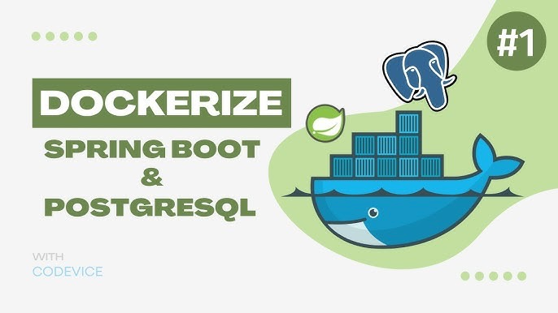

= Developing in Containers
:revealjs_theme: sky
:revealjs_hash: true
:source-highlighter: highlight.js
:revealjs_plugins: math, notes, search, zoom, highlight, markdown, chart

== Roadmap
We'll cover:
[%step]
* What are dev containers?
* Why use dev containers?
* How to set up a dev container in VS Code
* Complete example 

=== Example 
[%step]
* Develop Spring Boot 3.5
* based on OpenJDK 21 
* with PostgreSQL 17.5
* and Adminer for database management
* guaranteed to work on any machine with Docker and VS Code

[%notitle]
== https://www.youtube.com/watch?v=3fALfjlkfuU[Logo]

footnote:[https://www.youtube.com/watch?v=3fALfjlkfuU]

== Introduction
[%step]
* Separating setup from host
* Consistent and reproducible.
* They simplify onboarding, isolate dependencies, and improve productivity.

== What is a Dev Container?
[%step]
* A dev container is a Docker-based environment defined by configuration files.
* Environment includes IDE, tools, services...
* VS Code integrates tightly with dev containers using the Remote - Containers extension.

== Why Use Dev Containers?
image::https://code.visualstudio.com/assets/docs/remote/containers/architecture-containers.png[Dev Container Architecture,600,auto]
[%step]
* Eliminate “works on my machine” problems.
* Standardize tools and dependencies.
* Easy onboarding for new team members.
* Seamless integration with CI/CD.
* Run supporting services (e.g., databases) locally.

== How
[%step]
* Install VS Code.
* Install the "Dev Containers" extension (Remote - Containers).
* Create `.devcontainer` folder to define configuration:
** `devcontainer.json` (or `devcontainer.yaml`)
** `docker-compose.yml` (multi-service)

=== devcontainer.json
[%step]
* Main configuration file is `devcontainer.json` or `devcontainer.yaml`
* It defines the container environment

=== Simple Example
[source,json]
----
{
	"name": "Ubuntu:24.10",
	// Or use a Dockerfile or Docker Compose file. More info: https://containers.dev/guide/dockerfile
	"image": "mcr.microsoft.com/devcontainers/java:0-11-bullseye",
	"mounts": [
		"source=${localWorkspaceFolder},target=/workspace,type=bind,consistency=cached"
	],
	"postStartCommand": "echo 'Devconmtainer are 🔥 shit'"
}
----

=== More complex Example

[source,json]
----
{
  "name": "Java + PostgreSQL Dev",
  "dockerComposeFile": "docker-compose.yml",
  "service": "springboot",
  "workspaceFolder": "/workspace",
  "settings": { "terminal.integrated.shell.linux": "/bin/bash" },
  "extensions": [
    "vscjava.vscode-spring-boot",
    "ms-azuretools.vscode-docker",
    "ms-python.python",
    "anweber.httpbook",
    "humao.rest-client",
    "asciidoctor.asciidoctor-vscode",
    "ms-azuretools.vscode-docker",
    "ritwickdey.LiveServer"
  ]
}
----

=== docker-compose.yml

* define and wireup containers

[source,yaml]
----
services:
  springboot:
    build: .
    volumes:
      - .:/workspace
    ports:
      - "8080:8080" // host-port : container-port
    depends_on:
      - db
  db:
    image: postgres:16
    environment:
      POSTGRES_USER: devuser
      POSTGRES_PASSWORD: devpass
      POSTGRES_DB: devdb
    ports:
      - "5432:5432"
----

== Spring Boot in Dev Containers
image::https://spring.io/images/spring-boot-logo.png[Spring Boot,200,auto]
[%step]

== Advantages Recap

* Consistent, portable, and disposable environments.
* Easy to update dependencies and tools.
* Reduces onboarding time for new developers.
* Integrated debugging and testing in VS Code.

== Resources

* https://github.com/CWACoderWithAttitude/dc-spring-boot-mvp[Sping Boot MVP]
* https://code.visualstudio.com/docs/devcontainers/containers[Developing inside a Container]
* https://code.visualstudio.com/docs/remote/containers
* https://containers.dev/
* https://hub.docker.com/_/postgres
* https://spring.io/projects/spring-boot

== Q&A

*Any questions?*

[%notitle]
== Thank You

image::https://upload.wikimedia.org/wikipedia/commons/e/ea/Thats_all_folks.svg[Warner Bros., Public domain, via Wikimedia Commons]

=== Funfact
This slideshow was coded using AsciiDoc and the Reveal.js framework. In devcontainers!