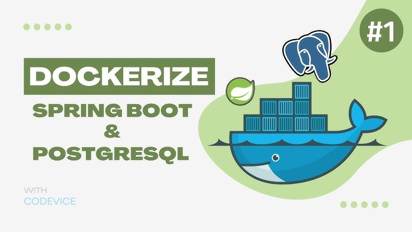
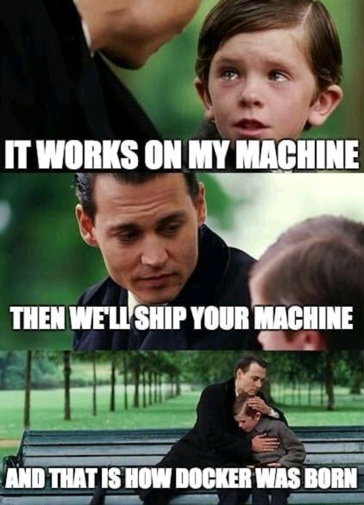

= Dev Containers
:revealjs_theme: sky
:source-highlighter: highlight.js

footnote:[https://www.youtube.com/watch?v=3fALfjlkfuU]

== TL;DR

Dev Containers let you use your local IDE to develop inside an isolated, portable container environment

== Disclaimer
- This is a high-level introduction to Dev Containers. It does not cover all aspects of Dev Containers
- It is meant to give you an overview of what Dev Containers are, how they work and why.
- This intro focuses on VS Code.

== _

== IDEs
[%step]
- Can be used with any IDE that supports Dev Containers
  * Visual Studio Code
  * Intellij IDEA (Enterprise)
  * GitHub Codespaces

== IDEs w/o Dev Container Support
[%step]
* Even IDes that do not support Dev Containers can be used
* You can use the container as a development environment and connect to it via SSH or other

== Challenge
[%step] 
* sss

* Paradigm: one Usecase - one container

== Dev Container architecture
image::https://code.visualstudio.com/assets/docs/devcontainers/containers/architecture-containers.png[canvas,size=contain]
=== Because containers 

* You want to benefit from the isolation and portability of containers
* You want to share your development environment with your team
* you want to make onboarding new developers easier
* You want to use your own local IDE to develop applications
* You want to use your own tools and workflows
* You want to avoid "it works on my machine" issues 
* For sure there're many more reasons, but these are the most common ones.

== What are Dev Containers?

In short:
[%step]
* they define a development environment in a container(s)
* provide tooling for your local IDE
* portable and reproducible
* language agnostic

=== they define a development environment in a container(s)
[%step]
- Can be just one container or
- A containers your task requires

=== provide tooling for your local IDE
[%step]
- Ship your IDE with a all modules and extensions you need
- Configuration for code styling, linters, formatters, etc.
- Even IDEs with Dev Container support can be used
  
=== portable and reproducible
[%step]
* Entire setup in text files
* Can be versioned and shared via VCS
* You can share your Dev Container setup with your team
* You can use the same Dev Container setup on different machines

=== Environment in Containers
[%step]
* your team doesn't have to install anything
* prevent configuration drift

=== Tooling for your IDE
[%step]
* ship IDE and tools setup with your project

=== Portable and Reproducible
* VS Code and Docker are installed

== How

Dev Containers are defined in a text file called `devcontainer.json`. This file contains the configuration for the container setup, including the container image, environment variables, and other settings. The Dev Container can be built and started automatically by your IDE, allowing you to focus on writing code instead of managing your development environment.

== Why Dev Containers?

[%step]
* Define your dev setup CaC style
* Your entire setup in VCS

[.note]
VCS: share your setup, make your setup deterministic

== Benefits of Dev Containers

=== From a Dev PoV
[%step]
* Isolation of dependencies and configurations
* Ability to use your own local IDE and tools

=== From a Team PoV

[%step]
* Consistent dev env across different machines and team members
* Easy to share and collaborate on code with others
* Simplifies onboarding for new developers

[.note]
* Image all use the same cide style settings, linters, formatters, etc.
* No more "it works on my machine" issues
* Easier to manage dependencies and configurations

== Use Cases

* Developing cloud-native applications
* Working on microservices architectures
* Collaborating on code with other developers
* Testing and debugging applications in a controlled environment

== Requirements

* Docker Desktop installed
* Visual Studio Code with the https://marketplace.visualstudio.com/items?itemName=ms-vscode-remote.remote-containers[Dev Containers] extension

[.note]
* Podman should work, too - but not covered today.
* Intellij IDEA (Enterprise) with the Dev Containers plugin
  * works, too - but not covered in this session.
- Dev Containers are not tied to a specific IDE or toolchain
== ReCap

Quick recap on Containers

=== Setup

[%step]
* Stored in a text file - usually called `Dockerfile`
* Can be added to SVC like any other source artifact
* This file is used to build a container image

=== Configuration

- Usually done via environemnt variables
- Can be done via configuration files

[.note]
- Concept of environment variables is language agnostic

[%step]
* the setup and configuration is stored in a text file - usually called `Dockerfile`
* Can be handled like any other source artifact
   * Versioning
   * Branching
   * Diffing
* This file is used to build a container image

=== Image

[%step]
* Like a read-only template to spawn containers from
* Usually conaines just one service
* Contains everything needed to run the application
  * Application code
  * Dependencies
  * Configuration files
  * Environment variables
* Can be versioned and stored in a registry like Dockerhub or Quay.io

=== Isolation

* (Docker-) Containers execute an application or service in an isolated environment
* services are isolated from each other

=== Information exchange
* Services in containers communicate via network
* Usually via HTTP, gRPC, MQTT, JDBC...

=== Container Stack(s)
[%step]
* Group of containers that work together to provide a service
* Usually consists of a database, a backend service and a frontend service
* Can be defined in a text file - usually called `docker-compose.yml`
* This file is used to spawn a group of containers
* containers in a stack are connected to each other

== Say Hello to DevContainers
[%step]
* Dev Containers are a special kind of container setup
* They let you use your own,local IDE to develop applications
  * Your system - your rules.

== How does it work?
The idea behind it a nutshell:
[%step]
* You define a container setup in a text file
* You use your local IDE to work on the code
* The IDE connects to the container and uses it as a development environment
* The container is built and started automatically

== Starting a Dev Container
[%step]
* You need to have a `/.devcontainer/devcontainer.json` file in your project root 
* This file contains the configuration for the Dev Container
* You can use the `devcontainer.json` file to define the container setup
* You can use the `Dockerfile` to define the container image
* You can use the `.env` file to define environment variables for the container

[.note]
- The `devcontainer.json` file is the heart of the Dev Container setup
- This i
=== Bare Minimum OpenJDK 21 Container
[source,json]
include::./.devcontainer/devcontainer.json[]  

== References
[%step]
* https://www.docker.com/blog/introducing-dev-containers/
* https://code.visualstudio.com/docs/remote/containers
* https://www.jetbrains.com/help/idea/devcontainers.html
* https://docs.github.com/en/codespaces/setting-up-your-project-for-codespaces/adding-a-dev-container-configuration/introduction-to-dev-containers[GitHub Dev Containers]
* https://medium.com/versent-tech-blog/introduction-to-dev-containers-4c01cb1752a0[ Introduction to Dev Containers]

== Images
* https://www.youtube.com/watch?v=3fALfjlkfuU